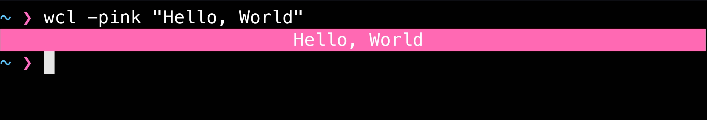
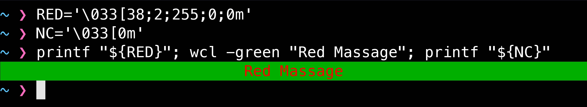
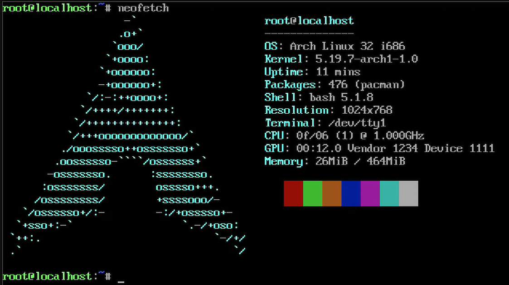

# 🎨 Wall Color Tool (WCL)

`wcl` 是一個用 Bash 撰寫的小工具，能夠在終端機中輸出「置中」顯示、帶有背景色的文字。

---

## 使用方式

### 基本用法

```bash
wcl -[顏色] "你的文字"
```

- 範例

```bash
wcl -pink "Hello World!"
wcl -red "WARNING: Something is wrong."
```



### 進階用法

若你希望自訂`字體顏色`或`加粗文字`，可搭配 `printf` 和定義好的顔色變數使用  
前提是你需要定義好顔色變數

- 我知道這太複雜了，後期會新增加快速的寫法的

```bash
RED='\033[38;2;255;0;0m'
NC='\033[0m'
printf "${RED}"; wcl -green "Red Massage"; echo -n "${NC}"
```



---

## `wcl`所支援的顏色 🎨

| 參數      | 顏色說明 |
| --------- | ----    |
| `-yellow` | 黃色背景 |
| `-pink`   | 粉紅背景 |
| `-gray`   | 灰色背景 |
| `-red`    | 紅色背景 |
| `-green`  | 綠色背景 |
| `-blue`   | 藍色背景 |
| `-purple` | 紫色背景 |
| `-cyan`   | 青色背景 |

---

## 安裝

---

🌐 語言支援  
首次安裝時提示選擇語言  
英語/中文

👤 製作者

- `Clyde Cole`

[GitHub: Clyde Cole](https://github.com/ClydeCole)

---

## ⚠️ 注意事項

本版本仍處於早期開發階段，架構與指令格式仍可能更動

依據目前測試，兼容性較爲完善，可在  
64 bit ubuntu 24.04  
32 bit arch lnux  
64 bit aarch android  
運行

- arch linux



- 執行效果

