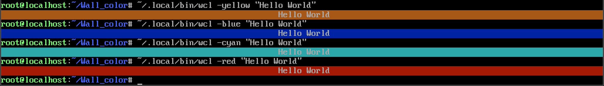

# 🎨 Wall Color Tool (WCL)

`wcl` 是一個用 Bash 撰寫的小工具，能夠在終端機中輸出「置中」顯示、帶有背景色的文字。

---

- 目前發現一個bug，由於工具內使用了一行python命令來識別用戶輸入的文本文字，
- 導致出現了shell和python一起轉義一段文本。
- 這會發生什麼情況？
  - 例如，當輸入`wcl -pink "he\\nllo"` 實際輸出時`正確結果he\nllo`將會變成`he llo`（空格爲換行符）
- 如何解決問題？
  - 目前在bug未修復前
  - 請不要使用雙引號`""`來包裹文本
  - 請使用單引號`''`或不使用引號來輸入文本內容
  - 不使用引號話請使用轉義符`\`來轉義空格（否則會被識別被多個參數）

---

## 使用方式

- 基本用法

```bash
wcl -[顏色] "你的文字"
```

- 範例

```bash
wcl -pink "Hello World!"
wcl -red "WARNING: Something is wrong."
```


---

- 進階用法
  - 若你希望自訂`字體顏色`或`加粗文字`，可搭配 `printf` 和定義好的顔色變數使用
    前提是你需要定義好顔色變數
- 我知道這太複雜了，後期會新增加快速的寫法的

```bash
RED='\033[38;2;255;0;0m'
NC='\033[0m'
printf "${RED}"; wcl -green "Red Massage"; echo -n "${NC}"
```


---

- 如要查看幫助文檔終端鍵入 `wcl -h` `wcl -help` `wcl --help`

---

## `wcl`所支援的顏色 🎨

|參數|顏色說明|
|-|-|
| `-yellow` | 黃色 |
| `-pink`   | 粉色 |
| `-gray`   | 灰色 |
| `-red`    | 紅色 |
| `-green`  | 綠色 |
| `-blue`   | 藍色 |
| `-purple` | 紫色 |
| `-cyan`   | 青色 |

---

## 安裝

由於我們在v1.0版本大幅度重寫了wcl
重寫後的版本與之前完全不同，可以說幾乎全都重新編寫了一遍
因此，我們希望您可以在安裝時選擇不低於1.0的版本

- 1: 克隆倉庫 (推薦方式)
終端鍵入

```shell
git clone https://github.com/ClydeCole/Wall_color
cd Wall_color
bash install.sh
```

- 2: 下載源碼解壓縮安裝
  - 下載某一版本zip源碼
  - 解壓縮
  - 進入目錄
  - 執行 `bash install.sh`

---

## 卸載

- 刪除程式僅需打開終端輸入

```shell
rm ~/.local/bin/wcl
rm -rf ~/.local/share/wcl/
```

---

## 🌐 語言支援

- 首次安裝時提示選擇語言  
  英語/中文

- 在終端鍵入 `wcl -lang "指定語言"` 或 `wcl -lang` 進行修改語言

👤 製作者

- `Clyde Cole`

[GitHub: Clyde Cole](https://github.com/ClydeCole)

---

依據目前測試，兼容性較爲完善，可在  
64 bit ubuntu 24.04  
32 bit arch lnux  
64 bit aarch android  
運行

- arch linux


- 執行效果


