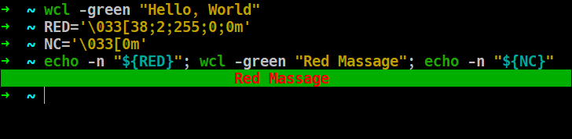

# 🎨 Wall Color Tool (WCL)
### ✨ 簡介：

 `wcl` 是一個用 Bash 撰寫的小工具，能夠在終端機中輸出「置中」顯示、帶有背景色的文字。  
非常適合用在腳本提示、警告訊息或狀態顯示。

---
### 使用方式
- 基本用法
```bash
wcl -[顏色] "你的文字"
```

- 範例
```bash
wcl -pink "Hello World!"
wcl -red "⚠️ WARNING: Something is wrong."
```


- 進階用法
若你希望自訂`字體顏色`或`加粗文字`，可搭配 `echo -n` 和定義好的顔色變數使用：  
前提是你需要定義好顔色變數  
  - 我知道這太複雜了，後期會更改的
```bash
RED='\033[38;2;255;0;0m'
NC='\033[0m'
echo -n "${RED}"; wcl -green "Red Massage"; echo -n "${NC}"
```


🎨 `wcl`所支援的顏色
| 參數      | 顏色說明 |
| --------- | ----    |
| `-yellow` | 黃色背景 |
| `-pink`   | 粉紅背景 |
| `-gray`   | 灰色背景 |
| `-red`    | 紅色背景 |
| `-green`  | 綠色背景 |
| `-blue`   | 藍色背景 |
| `-purple` | 紫色背景 |
| `-cyan`   | 青色背景 |

🌐 語言支援  
~~首次打開Hellp幫助文檔時會詢問語言（中文或英文）~~，正在製作了（遇見了點難處）。

📌 專案狀態  
開發狀態：開發中 🚧

👤 製作者  
- `Clyde Cole`

[GitHub: Clyde Cole](https://github.com/ClydeCole)

---
### ⚠️ 注意事項：
本版本仍處於早期開發階段，架構與指令格式仍可能更動

尚未處理輸入錯誤與極端情況

暫時無法解決輸出文本後終端縮放導致顯示出錯
